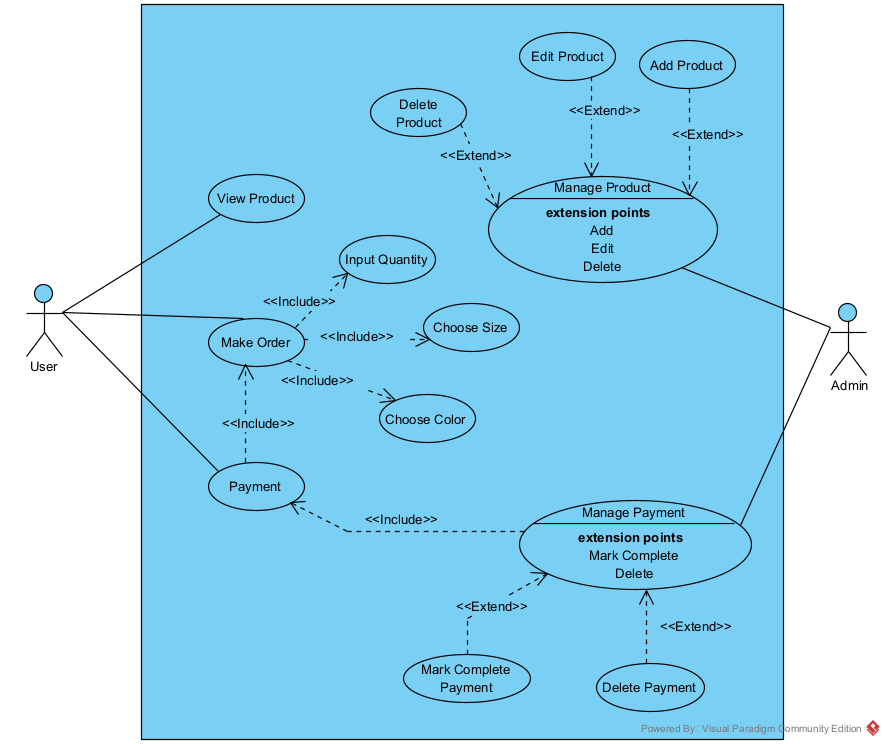
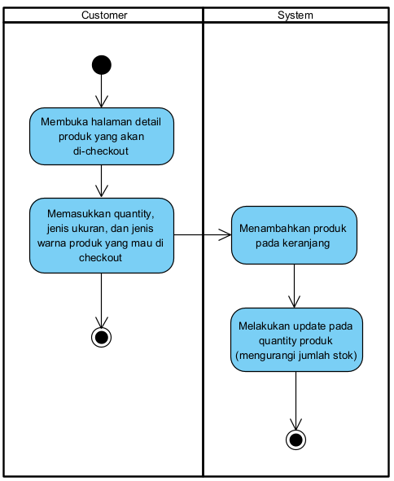
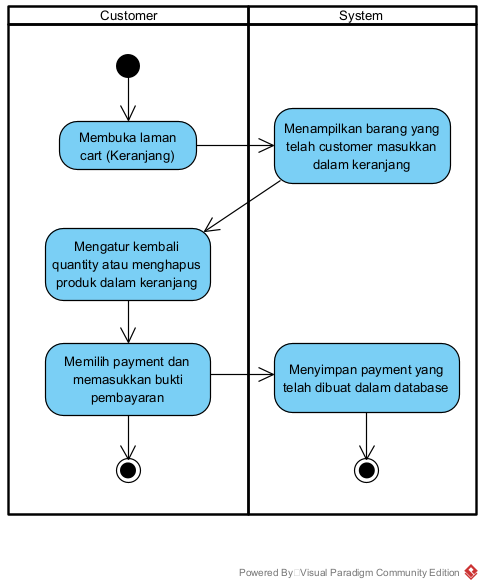
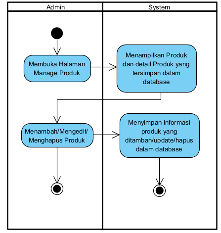
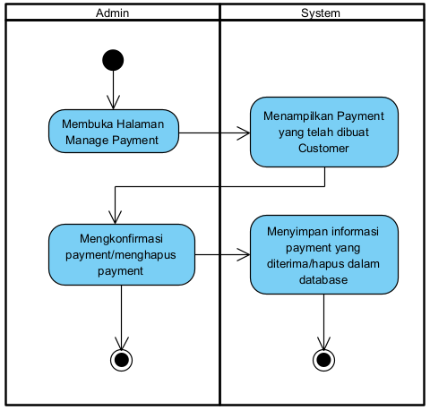
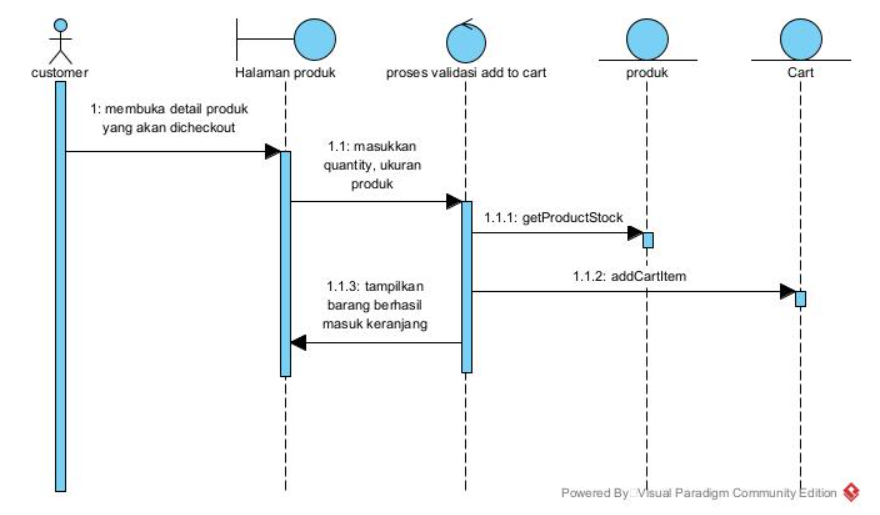
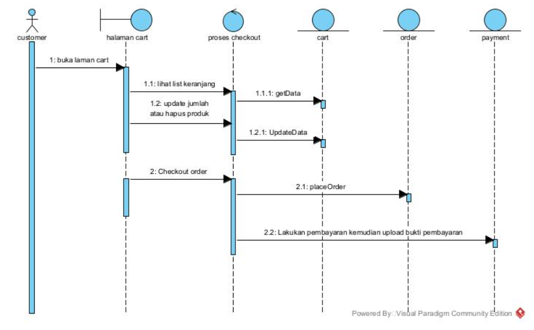
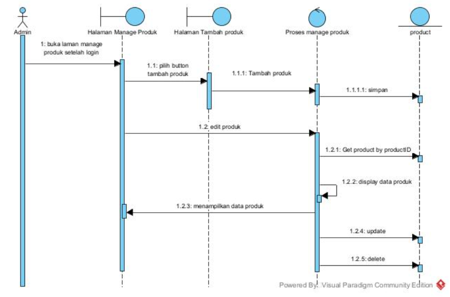
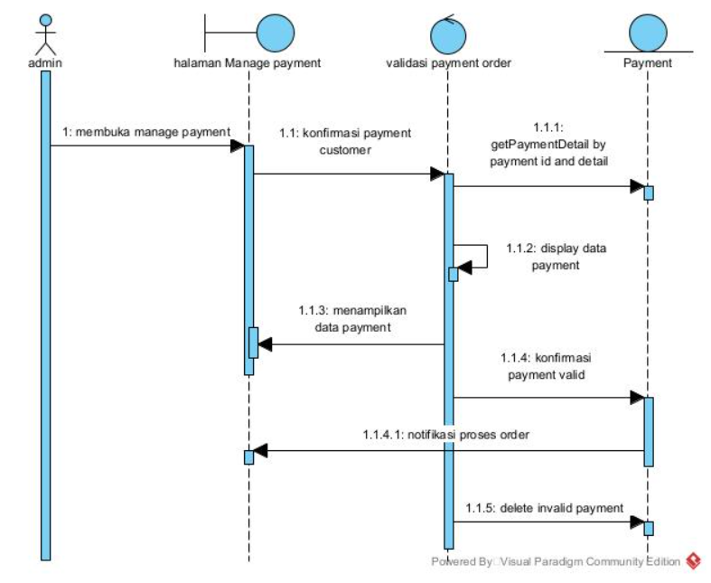
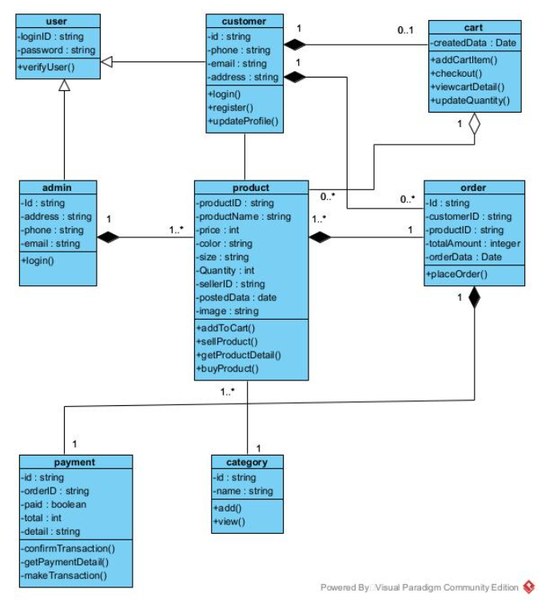

# Aplikasi Web E-commerce UMKM Fashion LIMAAWAKTU

Kelompok 3 Analisis dan Desain Sistem P3

### Anggota dan Role:
|  | Nama  | NIM | Role |
| - | ------------- | ------------- | -
| 1 | Safira Kirei Nisa  | G6401201039 | Front End Developer |
| 2 | Rabbani Elha Ahmad  | G64170078  | Project Manager |
| 3 | Ahmed Siddiq Arrafi Ibn Sakti  | G6401201117 | Back End Developer |
| 4 | Muhamad Hadziq Firza Rasendriya | G6401201055 | UI/UX |

## Deskripsi Aplikasi
Aplikasi yang kami buat merupakan web commerce guna membantu pelaku umkm dibidang fasahion untuk menjajakan produknya secara digital dan melakukan transaksi secara online agar mampu meningkatkan daya saing dan daya jual dari umkm. Aplikasi ini berfokus untuk menampilkan katalog produk dan juga melakukan order melalui laman web.

## Latar Belakang
Pemerintah Indonesia melalui pernyataan Presiden Indonesia Joko Widodo menargetkan 30 juta pelaku usaha mikro kecil dan menengah dapat bertransformasi dan menjajakan produknya melalui platform digital pada tahun 2024. Pada tahun 2023, pemerintah menargetkan setidaknya sudah ada 23 juta pelaku umkm yang menggunakan platform digital. Mendukung program pemerintah tersebut, maka tim kami menyepakati untuk menyelesaikan tugas proyek akhir mata kuliah analisis dan desain sistem untuk membentuk platform digital e-commerce dari pelaku umkm dibidang fashion yaitu limaawaktu.

## Tujuan
Pembuatan aplikasi web commerce ini guna memenuhi tugas akhir mata kuliah analisis dan desain sistem serta membantu target pemerintah dalam meningkatkan digitalisasi pelaku umkm

## User Story
| No. | Aktor | User Story | Acceptance Criteria |
| - | ------------- | ------------- | -
| 1 | Customer | Sebagai customer, saya ingin melihat dan membeli produk yang dijual. | Informasi produk tampil pada laman website dan bisa melakukan proses order |
| 2 | Administrator | Sebagai pelaku UMKM di bidang fashion, saya ingin menjajakan produk saya secara daring dan memiliki laman website sendiri agar produk dapat dijangkau oleh banyak customer sehingga meningkatkan jumlah penjualan | Pelaku UMK dapat memperlihatkan katalog produknya dan bisa terjadi proses jual beli. |

## Use Case Diagram

## Activity Diagram
### Make Order

### Make Payment

### Manage Product

### Manage Order

## Sequence Diagram
### Make Order

### Make Payment

### Manage Product

### Manage Order

## Class Diagram

## Testing Report
#### Class Name : Admin
#### Testing Scenario: Manage Product
<table>
  <thead>
      <th>Method Name</th>
      <th>Input</th>
      <th>Expected Output</th>
      <th>Actual Output</th>
      <th>Results</th>
  </thead>
  
  <tbody>
    <tr>
      <td>Add Product</td>
      <td>Nama Produk : Zayn Thobe   warna tersedia : gray   Ukuran tersedia : s, m, l, xl   jumlah stok : 100 </td>
      <td>
        <li> produk berhasil ditambahkan </li>
        <li> produk muncul pada katalog </li>
      </td>
      <td>produk berhasil ditambahkan dan muncul pada katalog</td>
      <td>passed</td>
    </tr> 
    <tr>
      <td></td>
      <td>Nama Produk : Azkal Thobe   warna tersedia : black   Ukuran tersedia : s, m, l, xl   jumlah stok : 100 </td>
      <td>
        <li> produk berhasil ditambahkan </li>
        <li> produk muncul pada katalog </li>
      </td>
      <td>produk berhasil ditambahkan dan muncul pada katalog</td>
      <td>passed</td>
    </tr> 
    <tr>
      <td></td>
      <td>Nama Produk : Kemko   warna tersedia : white   Ukuran tersedia : s, m, l, xl   jumlah stok : 100 </td>
      <td>
        <li> produk berhasil ditambahkan </li>
        <li> produk muncul pada katalog </li>
      </td>
      <td>produk berhasil ditambahkan dan muncul pada katalog</td>
      <td>passed</td>
    </tr>
</table> 

#### Class Name : Customer
#### Testing Scenario: Login, Add product to cart, payment
<table>
  <thead>
      <th>Method Name</th>
      <th>Input</th>
      <th>Expected Output</th>
      <th>Actual Output</th>
      <th>Results</th>
  </thead>
  
  <tbody>
    <tr>
      <td>Login()</td>
      <td>Memasukkan loginID dan password </td>
      <td>
        Login berhasil
      </td>
      <td>Login berhasil</td>
      <td>passed</td>
    </tr> 
    <tr>
      <td>AddToCart()</td>
      <td>memilih dan klik katalog yang ingin dibeli, pilih ukuran, warna, dan jumlah. klik add to cart</td>
      <td>
        berhasil menambahkan produk kedalam cart (keranjang)
      </td>
      <td>berhasil menambahkan produk kedalam cart</td>
      <td>passed</td>
    </tr> 
    <tr>
      <td>Payment</td>
      <td>klik proceed to checkout pada cart, pilih metode payment, klik pay Now </td>
      <td>
        proses payment berhasil dilakukan
      </td>
      <td>data terekam, payment berhasil dilakukan</td>
      <td>passed</td>
    </tr>
</table> 
